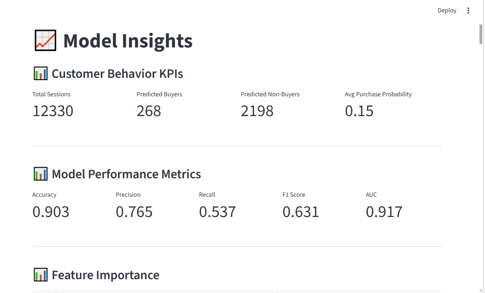

# Customer Behavior Prediction System

Machine Learning system that predicts whether an online visitor will make a purchase based on browsing behavior.

## Features

• Real-time customer purchase prediction
• Batch dataset prediction (CSV upload)
• Model performance analytics
• Feature importance analysis
• Customer segmentation with K-Means
• Interactive Streamlit dashboard
• Downloadable prediction reports

## Machine Learning Pipeline

Dataset → Preprocessing → Random Forest Model → Predictions → Streamlit Dashboard

## Model Performance

| Metric    | Score |
| --------- | ----- |
| Accuracy  | ~0.89 |
| Precision | ~0.74 |
| Recall    | ~0.62 |
| F1 Score  | ~0.67 |
| AUC       | ~0.92 |

## Dashboard Preview

## Tech Stack

Python
Scikit-Learn
Pandas
Matplotlib
Streamlit

## Author

Mohammed Grema Alkali and Bashir Umar Zanna
Master's in Computer Applications.
