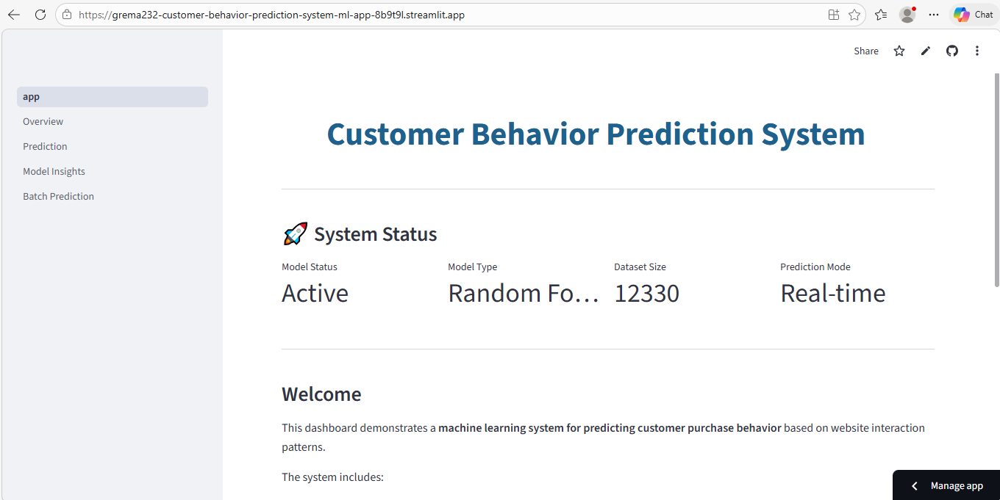

# Customer Behavior Prediction System

[]()
[]()
[]()

Machine Learning dashboard for predicting customer purchase behavior and generating actionable marketing insights.

---

## 🚀 Live Demo

Try the deployed application here:

**https://grema232-customer-behavior-prediction-system-ml-app-8b9t9l.streamlit.app**

The live dashboard allows users to upload datasets, run predictions, and explore customer behavior insights interactively.

---

## Overview

This project presents a machine learning system designed to predict whether a website visitor is likely to make a purchase based on their browsing behavior.

The system combines a trained **Random Forest classification model** with an **interactive Streamlit analytics dashboard** to provide actionable insights for marketing teams.

The goal of this project is to demonstrate how machine learning can support **data-driven marketing decisions** in e-commerce environments.

---

## Key Features

• Real-time customer purchase prediction
• Batch prediction for uploaded customer datasets
• Model performance analytics (Accuracy, Precision, Recall, ROC-AUC)
• Feature importance analysis
• Customer segmentation using K-Means clustering
• Marketing decision insights
• Interactive multi-page Streamlit dashboard

---

## Dashboard Preview



---

## Technologies Used

* Python
* Pandas
* NumPy
* Scikit-learn
* Streamlit
* Matplotlib
* Seaborn

---

## Machine Learning Model

The predictive system uses a **Random Forest Classifier** trained on the **Online Shoppers Intention Dataset**.

The model analyzes visitor behavior patterns and predicts the probability that a visitor will complete a purchase.

### Model Evaluation Metrics

* Accuracy
* Precision
* Recall
* F1 Score
* ROC-AUC

These metrics measure the model’s ability to correctly identify high-intent customers.

---

## Project Architecture

The system follows a complete machine learning pipeline:

### 1. Data Collection

Customer browsing behavior dataset.

### 2. Data Preprocessing

* Handling missing values
* Encoding categorical variables
* Feature scaling and normalization

### 3. Model Training

Random Forest classifier trained on historical customer behavior data.

### 4. Model Evaluation

Performance measured using:

* Accuracy
* Precision
* Recall
* ROC-AUC

### 5. Prediction System

The trained model is integrated into a **Streamlit dashboard** to generate predictions in real time.

### 6. Insights Dashboard

The application visualizes customer patterns and provides insights for marketing teams.

---

## Business Value

The system helps businesses:

* Identify high-intent customers
* Improve marketing targeting
* Reduce bounce rates
* Optimize product page engagement
* Increase conversion rates
* Improve marketing campaign efficiency

---

## Real World Use Case

This system can support **e-commerce companies** in optimizing marketing strategies.

### Example Workflow

1. A company collects browsing behavior data from website visitors.
2. The dataset is uploaded into the prediction system.
3. The model predicts which visitors are most likely to make a purchase.
4. Marketing teams can target high-intent visitors with personalized promotions.

This leads to **higher marketing ROI and improved customer engagement**.

---

## Project Structure

```
Customer_Behavior_Prediction_System

data/
models/
notebooks/
pages/
screenshots/

app.py
train_model.py
test_model.py

rf_pipeline_streamlit.pkl
model_auc.pkl

README.md
requirements.txt
LICENSE
.gitignore
```

---

## Installation

Clone the repository:

```
git clone https://github.com/Grema232/Customer-Behavior-Prediction-System-ML.git
```

Navigate into the project directory:

```
cd Customer-Behavior-Prediction-System-ML
```

Install dependencies:

```
pip install -r requirements.txt
```

Run the Streamlit application:

```
streamlit run app.py
```

---

## Future Improvements

* Deploy model monitoring for prediction drift
* Integrate real-time customer analytics data
* Add advanced models such as XGBoost or LightGBM
* Implement automated model retraining
* Build REST API for production integration

---

## Authors

**Mohammed Grema Alkali**
Master’s in Computer Applications – Data Science Focus

**Bashir Umar Zanna**
